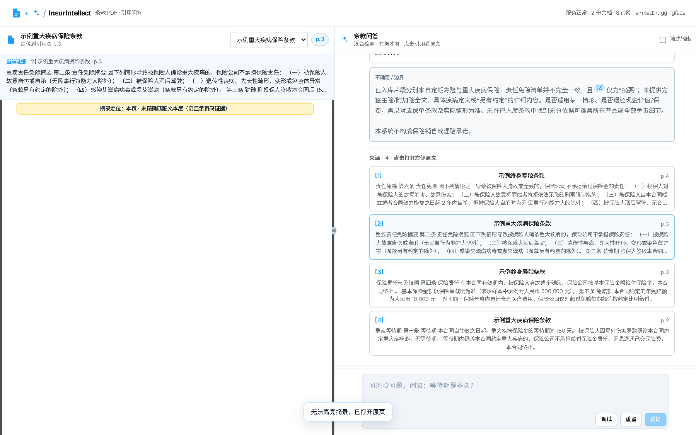
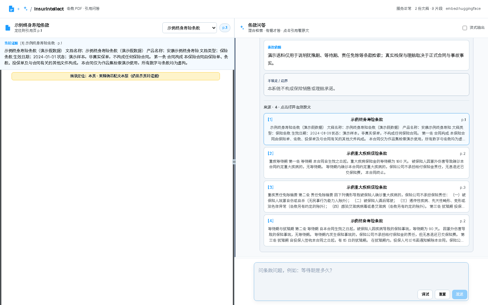
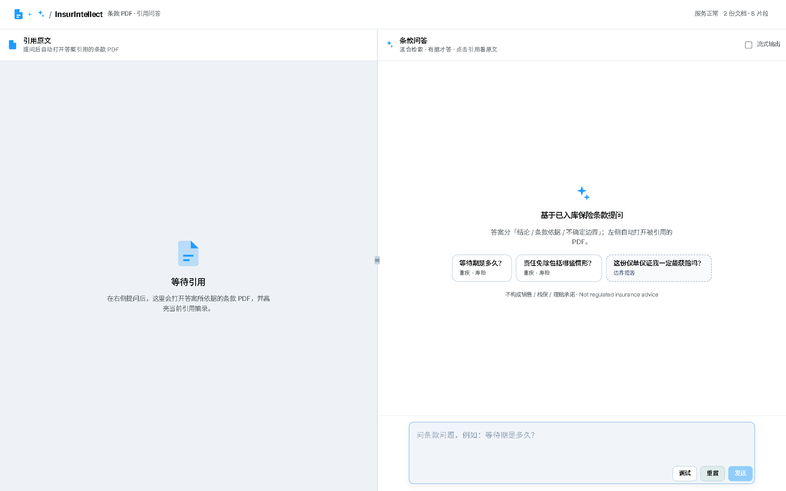

# InsurIntellect Agent

**An open-source insurance-clause AI agent for local, evidence-grounded Q&A.**

[English](README.md) | [中文](README.zh-CN.md)

<!-- Status: static badges work while repo is private.
     Dynamic github.com / shields.io GitHub metrics show "repo not found" on private repos.
     Switch CI/License/stars rows to dynamic shields after the repo is public. -->
[](https://github.com/Phoenix0531-sudo/InsurIntellect-Agent/actions/workflows/ci.yml)
[](LICENSE)
[](https://www.python.org/downloads/)
[](#quickstart)

<!-- Product / stack (honest static — no fake PyPI / Discord / Downloads) -->
[](https://fastapi.tiangolo.com/)
[](https://www.trychroma.com/)
[](#architecture)
[](#provider-notes)
[](#provider-notes)
[](#quickstart)
[](#architecture)
[](#preview)
[](#disclaimer)


<p align="center">
  
  
</p>
<p align="center">
  
  
</p>
<p align="center"><sub>Main UI · Citations · Refuse / advice · Empty state — full-size assets under <code>docs/screenshots/</code></sub></p>

InsurIntellect is a **portfolio-ready financial agent demo** for insurance policy / clause PDFs:

- Index a local clause corpus
- Hybrid retrieve (vector + BM25)
- Answer only with **traceable citations**
- **Refuse** purchase advice, guarantee claims, and off-topic questions

It is **not** a multi-tenant SaaS, **not** an agent canvas platform, and **not regulated insurance advice**.

Product narrative is aligned with financial-agent peers such as [FinRobot](https://github.com/AI4Finance-Foundation/FinRobot) (agent + provenance). Evidence UI follows a lightweight RAGFlow-style knowledge-base + citations layout. Disclaimer tone draws from [FinGPT](https://github.com/AI4Finance-Foundation/FinGPT).

---

## Table of contents

- [Why InsurIntellect](#why-insurintellect)
- [Design principle](#design-principle)
- [Preview](#preview)
- [Architecture](#architecture)
- [Core capabilities](#core-capabilities)
- [Tech stack](#tech-stack)
- [Quickstart](#quickstart)
- [Demo questions](#demo-questions)
- [API](#api)
- [Project layout](#project-layout-main-path)
- [Tests and CI](#tests--ci)
- [Scope](#scope)
- [Provider notes](#provider-notes)
- [Disclaimer](#disclaimer)
- [License](#license)
- [Related reading](#related-reading-structure-inspiration-only)

---

## Why InsurIntellect

1. **Insurance text is high-stakes.** Generic chatbots invent waiting periods and exclusions. This demo **gates answers on retrieval** and shows **document / page / excerpt** when it answers.
2. **Provenance over polish.** Like FinRobot’s “numbers are code-calculated; narratives are LLM-assisted,” here **clauses are retrieved; narration is LLM-assisted; refuse when evidence is weak**.
3. **Portfolio-honest scope.** One vertical path (local PDF → hybrid retrieve → cited answer / refuse). No fake multi-tenant SaaS, no equity multi-agent cosplay, no “guaranteed payout” bot.
4. **Reproducible demo.** Public synthetic samples, forced BGE + threshold in `run_demo`, fixed smoke cases (Q1/Q2/Q3/weather), CI without live LLM keys.

---

## Design principle

A core design choice of InsurIntellect is the strict separation between **retrieval evidence** and **LLM narration**:

```text
Clauses are retrieved from the indexed corpus.
Narratives are LLM-assisted (OpenAI-compatible).
Every answer is citation-tracked — or refused.
```

| Layer | What it does | What it does not do |
|-------|----------------|---------------------|
| **Corpus / ingest** | Chunk PDFs, embed, build BM25 + Chroma | Invent policy text |
| **Retrieve** | Hybrid top-k, score gate | Guarantee claim outcomes |
| **Answer** | Structure conclusion / basis / boundary with `[1][2]` | Give purchase or underwriting advice |
| **Public citations** | Show real scored chunks for grounded answers | Expose filler / zero-score sources on refuse & advice |

When evidence is weak, missing, or the user asks for regulated advice, the system returns a **refusal / boundary** response and keeps **public citations empty**.

---

## Preview


| View | File |
|------|------|
| Main two-pane UI | [docs/screenshots/preview.png](docs/screenshots/preview.png) |
| Citation cards | [docs/screenshots/citations.png](docs/screenshots/citations.png) |
| Refuse / advice boundary | [docs/screenshots/refuse_advice.png](docs/screenshots/refuse_advice.png) |
| Empty / cold start | [docs/screenshots/preview_empty.png](docs/screenshots/preview_empty.png) |

Left pane: product name, indexed documents, demo prompts, disclaimer.  
Right pane: dialogue, structured answer, citation cards (document / page / excerpt).  
UI shell is static HTML/CSS/JS (ChatPDF-like dual pane, accent `#1D9CFF`); product story is financial clause RAG, not generic PDF chat.

---

## Architecture

```text
samples/*.pdf  ──generate──►  data/documents/pdfs
        │
        ▼
 simple_ingest.py
   → Chroma (vectors) + BM25/jieba + corpus_manifest
        │
        ▼
 POST /api/v1/queries/ask
   hybrid retrieve top-k
   → gate: weak / off-topic / advice  →  refusal (citations empty)
   → else LLM structured answer with [1][2] + public_citations
        │
        ▼
 static/ UI  ·  light theme  ·  sources first-class
```

Default path is **`SIMPLE_RAG_MODE=true`**: retrieve → generate.

Off by default (advanced / optional code only): query rewriting, SQL routing, knowledge-graph injection, regulatory multi-agent chains.

### Answer kinds

| `answer_kind` | Meaning | Public `retrieved_chunks` |
|---------------|---------|---------------------------|
| `answer` | Grounded clause Q&A | Real scored citations |
| `refusal` | Off-topic / insufficient evidence | Empty |
| `advice` | Purchase / guarantee / “should I buy” style | Empty |
| `llm_unavailable` | No key or LLM failure; retrieval may still run | Policy-dependent (honest degrade) |
| `degraded` | Timeout / partial path | Best-effort, honest copy |

---

## Core capabilities

| Capability | Detail |
|------------|--------|
| Clause corpus first | Public fake sample PDFs only; no real customer policies in-repo |
| Hybrid retrieval | Chroma + BM25/jieba; default embed `hf:BAAI/bge-small-zh-v1.5` |
| Score gate | `SIMILARITY_THRESHOLD=0.32` for BGE (demo scripts force this) |
| Cited answers | Conclusion / clause basis / boundary + disclaimer line |
| Honest refuse | Weather, purchase advice, “guaranteed payout” → boundary, not free chat |
| Public citation policy | Answer keeps real scores; refuse/advice → `[]` |
| Evidence UI | Dual pane, citation cards, clickable `[n]`, status pill |
| Local-first | `uv` + **127.0.0.1:8766**; OpenAI-compatible gateway |

---

## Tech stack

| Layer | Choice |
|-------|--------|
| API | FastAPI + Uvicorn |
| Retrieve | Chroma + BM25/jieba hybrid |
| Embed | Local HF `BAAI/bge-small-zh-v1.5` (or `local:hash` offline) |
| LLM | OpenAI-compatible (`OPENAI_BASE_URL`) |
| UI | Static HTML / CSS / JS (`static/js/app.js`) |
| Tests | pytest + ruff critical rules (CI) |
| Demo | `scripts/run_demo.sh` / `.bat` + `demo_smoke.py` |

---

## Quickstart

### 1. Clone and environment

```bash
git clone https://github.com/Phoenix0531-sudo/InsurIntellect-Agent.git
cd InsurIntellect-Agent

uv venv .venv --python 3.11
# Windows: .venv\Scripts\activate
source .venv/bin/activate
uv pip install -r requirements.txt
uv pip install pytest ruff httpx

cp .env.example .env
# set OPENAI_BASE_URL / OPENAI_API_KEY for your OpenAI-compatible gateway
# preferred embedding (must match ingest + query):
# OPENAI_EMBEDDING_MODEL=hf:BAAI/bge-small-zh-v1.5
# SIMILARITY_THRESHOLD=0.32
# offline fallback: OPENAI_EMBEDDING_MODEL=local:hash  (re-ingest after switch)
```

### 2. Sample corpus + ingest

```bash
uv run python scripts/generate_sample_corpus.py --copy-to-data
uv run python scripts/simple_ingest.py --reset
```

Samples are **public synthetic clauses** (waiting period, exclusions, free-look, etc.), not real policies.

### 3. One-command demo server

Shell env can pollute `.env`. Prefer the demo launcher, which **re-forces** BGE + threshold:

```bash
bash scripts/run_demo.sh
# Windows: scripts\run_demo.bat
```

Or manually:

```bash
export HOST=127.0.0.1 PORT=8766
export OPENAI_EMBEDDING_MODEL=hf:BAAI/bge-small-zh-v1.5
export SIMILARITY_THRESHOLD=0.32
export HF_HUB_OFFLINE=1 TRANSFORMERS_OFFLINE=1
export SIMPLE_RAG_MODE=true
uv run uvicorn app.main:app --host 127.0.0.1 --port 8766
```

Open **http://127.0.0.1:8766/**  
API docs (when `DEBUG=true`): **http://127.0.0.1:8766/docs**

If the LLM key is missing, the API still returns an honest **LLM unavailable** path instead of inventing coverage.

### 4. Fixed smoke (server must be up)

```bash
# Linux/macOS/git-bash
.venv/bin/python scripts/demo_smoke.py
# Windows
.venv\Scripts\python.exe scripts\demo_smoke.py
```

Covers Q1 / Q2 / Q3 / off-topic weather and asserts `answer_kind` + citation honesty.

---

## Demo questions

| ID | Question | Expectation |
|----|----------|-------------|
| Q1 | 等待期是多久？ | Cited answer from sample clauses (`answer`, ≥1 citation) |
| Q2 | 责任免除包括哪些情形？ | Multi-point exclusions with citations |
| Q3 | 这份保单保证我一定能获赔吗？ | `advice` boundary; **public citations empty** |
| WX | 今天北京天气怎么样？ | `refusal`; **public citations empty** |

---

## API

| Method | Path | Notes |
|--------|------|--------|
| `GET` | `/api/v1/health/` | DB / vector / LLM status |
| `GET` | `/api/v1/corpus` | Indexed document list for the left pane |
| `POST` | `/api/v1/queries/ask` | Body: `{ "question": "...", "stream": false }` |

Stable response fields include `question`, `answer`, `answer_kind`, `retrieved_chunks[]` (`document_name`, `page_number`, `content`, `similarity_score`), `chunks_used`, `confidence_score`, `response_time`.

Streaming uses the same `POST` with `"stream": true` (SSE); final event carries the same citation policy as non-stream.

Example:

```bash
curl -s http://127.0.0.1:8766/api/v1/queries/ask \
  -H 'Content-Type: application/json' \
  -d '{"question":"等待期是多久？","stream":false}'
```

---

## Project layout (main path)

```text
InsurIntellect-Agent
├── app/
│   ├── main.py                 # FastAPI entry, static mount
│   ├── api/                    # /health /queries /corpus
│   ├── core/                   # config, fusion, rag_workflow (backend retrieve)
│   ├── models/                 # schemas + lightweight DB models
│   ├── services/
│   │   ├── query_service.py    # SIMPLE path, refuse, public_citations
│   │   ├── embedding_service.py
│   │   └── llm_service.py
│   └── prompts.py
├── static/                     # dual-pane UI (single JS path: js/app.js)
├── scripts/
│   ├── generate_sample_corpus.py
│   ├── simple_ingest.py
│   ├── run_demo.sh / run_demo.bat
│   └── demo_smoke.py
├── samples/                    # public fake PDFs (source)
├── tests/                      # CI without live LLM keys
├── docs/screenshots/
├── .env.example
└── requirements.txt
```

---

## Tests & CI

```bash
uv run ruff check . --select E9,F63,F7,F82
uv run pytest -q tests
```

GitHub Actions runs the same critical ruff select set + `pytest tests/` **without** requiring a live LLM or embedding API key.

Workflow: [`.github/workflows/ci.yml`](.github/workflows/ci.yml)

---

## Scope

**In**

- Local insurance-like PDF corpus
- Hybrid retrieve + cited answers
- Refuse / advice / LLM-degrade honesty
- Static evidence UI on port 8766

**Out**

- Regulated sales / claim guarantees
- Multi-tenant auth / SaaS upload product
- Full PDF.js reader as a product requirement (assets may exist for highlight demos)
- Productized text-to-SQL / KG / multi-agent orchestration UI

Docker (`Dockerfile`, default port 8000) is optional. Portfolio demos prefer **uv + 8766**.

---

## Provider notes

- **LLM**: any OpenAI-compatible base URL (portfolio default: local new-api, e.g. `http://127.0.0.1:31876/v1`). Do not commit keys.
- **Embeddings**: default local HF `BAAI/bge-small-zh-v1.5` (free after cache). Keep **ingest and query on the same model**. After switching models, re-run `simple_ingest.py --reset`.
- **Hash fallback** `local:hash` is for offline demos only; ranking is weaker — lower threshold only if you knowingly use hash.

---

## Disclaimer

The software and sample documents in this repository are released under the **MIT** license for **demonstration and research**. They must **not** be construed as insurance sales, underwriting, claims handling, or regulated financial advice. Always consult qualified professionals and the official policy wording before any insurance decision.

**Not regulated insurance advice.**

---

## License

MIT. See [LICENSE](LICENSE).

---

## Related reading (structure inspiration only)

- [FinRobot](https://github.com/AI4Finance-Foundation/FinRobot) — financial AI agent platform; provenance / agent product narrative (primary README skeleton)
- [FinGPT](https://github.com/AI4Finance-Foundation/FinGPT) — open financial LLM ecosystem; Why + disclaimer style
- [RAGFlow](https://github.com/infiniflow/ragflow) — general RAG engine; knowledge-base + citation product shape (not insurance-specific)
