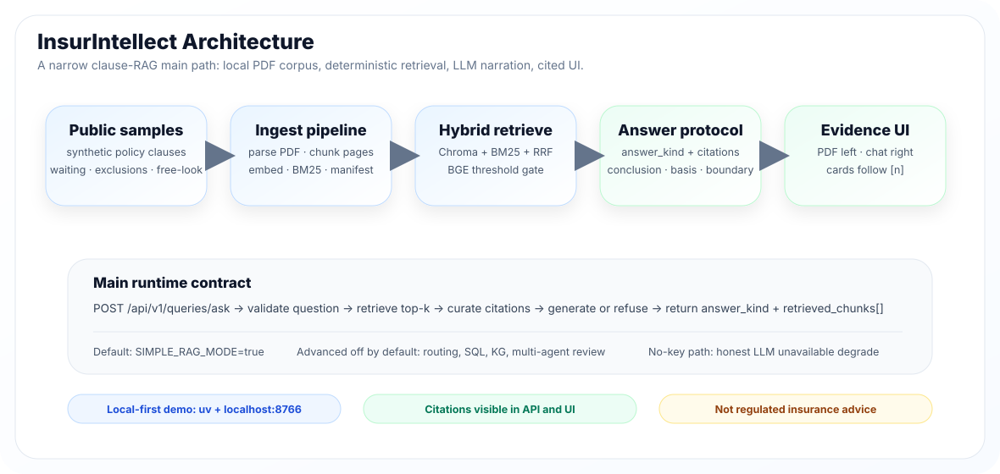
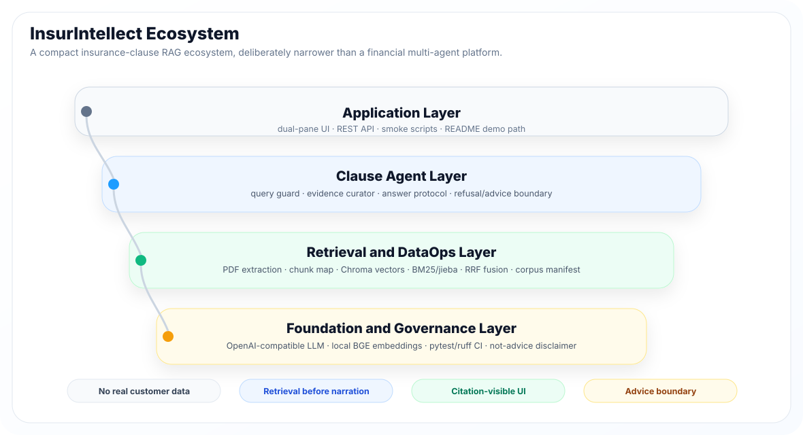
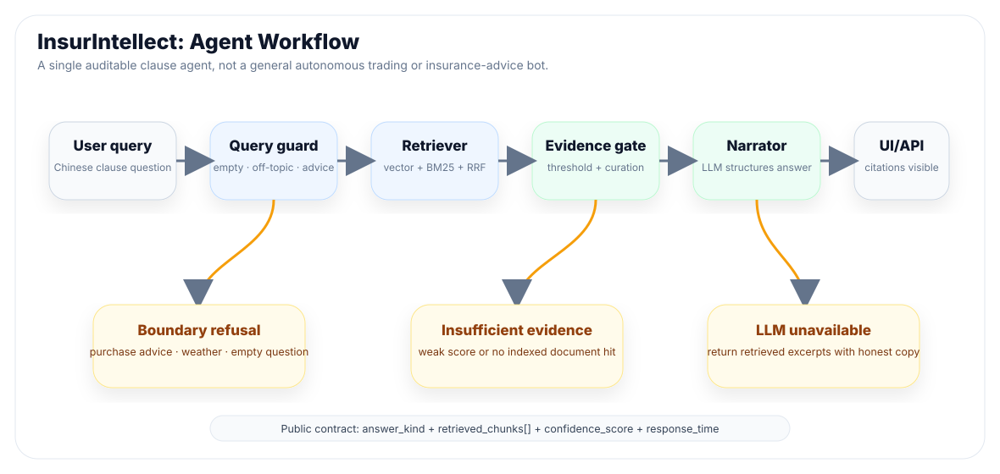
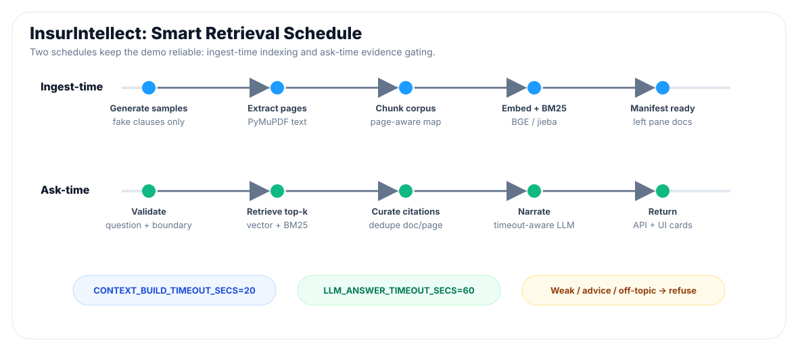
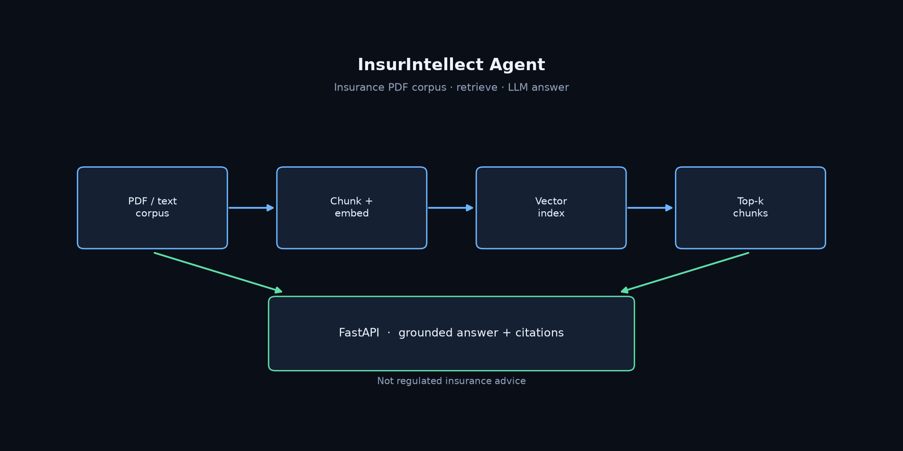

# InsurIntellect：面向本地保险条款 PDF 应用的开源证据型 AI Agent 系统，基于大语言模型生成带引用回答

[English](README.md) | [中文](README.zh-CN.md)

<!-- 动态 GitHub 徽章（仓库已公开） -->
[](https://github.com/Phoenix0531-sudo/InsurIntellect-Agent/actions/workflows/ci.yml)
[](LICENSE)
[](https://github.com/Phoenix0531-sudo/InsurIntellect-Agent/stargazers)
[](https://github.com/Phoenix0531-sudo/InsurIntellect-Agent/commits/master)
[](https://www.python.org/downloads/)
[](#快速开始)
[](https://fastapi.tiangolo.com/)
[](https://www.trychroma.com/)
[](#架构)
[](#条款证据型-rag-的概念)
[](#提供商说明)
[](#提供商说明)
[](#快速开始)
[](#架构)
[](#预览)
[](#免责声明)


<div align="center">
  
</div>

**InsurIntellect** 是面向保险条款 / 保单 PDF 的 AI Agent 系统。它构建本地条款语料库，用向量 + BM25 检索定位证据，再由 OpenAI 兼容大语言模型只负责把可追溯证据组织成回答。

**条款证据型 RAG 的概念：** 条款语料是环境，混合检索是工具层，语言模型是叙述层。它不是通用保险聊天机器人，不从模型记忆回答，也不扮演持牌保险顾问；只有当已入库条款能支撑答案时才回答，证据不足或触及监管边界时拒答。

本仓库刻意保持紧凑：它是保险条款版轻量 RAGFlow 主路径，不是多租户 SaaS，不是通用 ChatGPT 顾问，也不是 Agent 画布平台。

---

## 目录

- [InsurIntellect 是什么？](#insurintellect-是什么)
- [条款证据型 RAG 的概念](#条款证据型-rag-的概念)
- [架构](#架构)
- [条款检索，LLM 叙述](#条款检索llm-叙述)
- [代码库快照](#代码库快照)
- [InsurIntellect 生态](#insurintellect-生态)
- [InsurIntellect：Agent 工作流](#insurintellectagent-工作流)
- [InsurIntellect：智能检索调度](#insurintellect智能检索调度)
- [预览](#预览)
- [核心能力](#核心能力)
- [快速开始](#快速开始)
- [固定演示问题](#固定演示问题)
- [API](#api)
- [主路径目录](#主路径目录)
- [测试与 CI](#测试与-ci)
- [范围](#范围)
- [提供商说明](#提供商说明)
- [免责声明](#免责声明)
- [许可](#许可)
- [相关阅读](#相关阅读仅结构灵感)

---

## InsurIntellect 是什么？

InsurIntellect 是一个面向本地保险文档的条款证据型金融 AI Agent。它只聚焦一条可复现流程：

```text
本地条款 PDF → 混合检索 → 证据门闩 → 带引用回答或拒答
```

项目按作品集审阅方式设计：样例语料公开合成，API 足够小，UI 把证据放在一等位置，CI 不依赖真实 LLM Key。

## 条款证据型 RAG 的概念

保险条款文本风险很高。等待期、责任免除、免赔额、犹豫期等内容应该来自保单原文，而不是由聊天模型猜测。InsurIntellect 因此把已入库语料视为事实源，只有检索成功后才让 LLM 组织叙述。

1. **条款语料优先。** 回答必须来自已索引 PDF，而不是模型记忆。
2. **溯源优先于流畅。** 有据回答必须展示文档 / 页码 / 摘录。
3. **边界也是产品功能。** 购保建议、保证获赔、离题问题直接拒答，而不是包装成泛泛聊天。
4. **可复现演示。** 公开合成样例、`run_demo` 强制 BGE + 阈值、固定 smoke（Q1/Q2/Q3/天气）、CI 不依赖在线 LLM Key。

---

## 架构

<div align="center">
  
</div>

InsurIntellect 只把一条主路径放在用户面前：

```text
samples/*.pdf
  → simple_ingest.py
  → Chroma 向量 + BM25/jieba + corpus_manifest
  → POST /api/v1/queries/ask
  → answer_kind + retrieved_chunks[]
  → 双栏证据 UI
```

默认 **`SIMPLE_RAG_MODE=true`**：retrieve → generate。

默认关闭（仅 advanced 可选）：查询重写、SQL 路由、知识图谱注入、监管多 Agent 长链。

## 条款检索，LLM 叙述

InsurIntellect 的核心设计原则是严格区分 **检索得到的条款证据** 与 **LLM 生成的叙述**。

保单事实由确定性代码路径给出：PDF 文本抽取、切块、嵌入、BM25、向量检索、RRF 融合和分数门闩。LLM 只在这些证据路径返回可用条款后，用于综合、措辞和结构化表达。

简言之：

```text
条款由检索提供依据。
叙述由 LLM 辅助组织。
每个输出要么带引用，要么拒答。
```

### 回答类型 `answer_kind`

| 值 | 含义 | 对外 `retrieved_chunks` |
|----|------|-------------------------|
| `answer` | 有据条款问答 | 真实得分引用 |
| `refusal` | 离题 / 证据不足 | 空 |
| `advice` | 购买 / 保证理赔 /「该不该买」 | 空 |
| `llm_unavailable` | 无 Key 或 LLM 失败；检索仍可进行 | 诚实降级策略 |
| `degraded` | 超时 / 部分路径 | 尽力返回 + 诚实文案 |

---

## 代码库快照

| 层 | 包含内容 |
|----|----------|
| **条款语料** | 公开合成样例 PDF 与生成脚本；不包含真实客户保单 |
| **入库流水线** | `scripts/generate_sample_corpus.py`、`scripts/simple_ingest.py`、Chroma 向量、BM25/jieba、语料 manifest |
| **检索运行时** | `QueryService`、`rag_workflow`、RRF 融合、BGE 阈值门闩、对外引用整理 |
| **回答协议** | `answer_kind`、`retrieved_chunks[]`、`public_citations`、结论 / 依据 / 边界结构 |
| **LLM 适配** | OpenAI 兼容客户端；无 Key 与超时均走诚实降级 |
| **产品 UI** | 静态 ChatPDF 式双栏：左侧语料 / 被引用 PDF，右侧回答 / 引用卡 |
| **验证** | `demo_smoke.py`、`empty_index_smoke.py`、pytest、ruff critical、GitHub Actions |

---

## InsurIntellect 生态

<div align="center">
  
</div>

整体框架分为四层：

1. **应用层：** 双栏 UI、REST API、smoke 脚本和 README 演示主路径。
2. **条款 Agent 层：** 查询门闩、证据整理、回答协议、拒答 / 建议边界。
3. **检索与 DataOps 层：** PDF 抽取、chunk map、Chroma 向量、BM25/jieba、RRF 融合、语料 manifest。
4. **基础与治理层：** OpenAI 兼容 LLM、本地 BGE 嵌入、pytest/ruff CI、不构成建议的免责声明。

## InsurIntellect：Agent 工作流

<div align="center">
  
</div>

1. **感知：** 接收用户问题，并识别空问题、离题、购保建议或保证理赔类请求。
2. **检索：** 用向量 + BM25 检索本地条款语料，并通过 RRF 融合排序。
3. **证据门闩：** 整理引用、按文档 / 页码去重，分数不足时停止生成。
4. **叙述：** LLM 只负责组织结论、条款依据与不确定 / 边界说明。
5. **行动：** 返回稳定 API 响应，并在 UI 中渲染引用卡。

## InsurIntellect：智能检索调度

<div align="center">
  
</div>

调度刻意保持简单。入库阶段把文档转换为带页码的 chunks、向量、BM25 索引和 corpus manifest；提问阶段验证问题、检索 top-k 证据、整理引用，然后选择 LLM 叙述或诚实拒答。

这是保险条款场景里的 smart scheduler：它根据证据质量在检索、拒答和 LLM 叙述之间选择，而不是引入沉重的多 Agent 平台。

---

## 预览



| 视图 | 文件 |
|------|------|
| 主界面双栏 | [docs/screenshots/preview.png](docs/screenshots/preview.png) |
| 引用卡 | [docs/screenshots/citations.png](docs/screenshots/citations.png) |
| 拒答 / 建议边界 | [docs/screenshots/refuse_advice.png](docs/screenshots/refuse_advice.png) |
| 冷启动 / 空态 | [docs/screenshots/preview_empty.png](docs/screenshots/preview_empty.png) |

左栏：产品名、已索引文档、示例问题、免责。<br>
右栏：对话、结构化答案、引用卡（文档名 / 页码 / 摘录）。<br>
UI 壳为静态 HTML/CSS/JS（ChatPDF 式双栏，主色 `#1D9CFF`）；产品故事是保险条款 RAG，不是通用 PDF Chat。

---

## 核心能力

核心能力包括：

| 能力 | 说明 |
|------|------|
| 条款语料优先 | 仓库仅公开假样例 PDF，不提交真实客户保单 |
| 混合检索 | Chroma + BM25/jieba；默认嵌入 `hf:BAAI/bge-small-zh-v1.5` |
| 分数门闩 | BGE 下 `SIMILARITY_THRESHOLD=0.32`；demo 脚本强制入库 / 查询一致 |
| 带引用回答 | 结论 / 条款依据 / 边界 + 一行免责 |
| 诚实拒答 | 天气、购保建议、「保证获赔」→ 边界，不当闲聊 |
| 对外引用策略 | answer 保留真实得分；refuse/advice → `[]` |
| 证据 UI | 双栏、引用卡、可点 `[n]`、状态 pill |
| 本地优先 | `uv` + **[IP]:8766**；OpenAI 兼容网关 |

---

## 快速开始

### 1. 克隆与环境

```bash
git clone https://github.com/Phoenix0531-sudo/InsurIntellect-Agent.git
cd InsurIntellect-Agent

uv venv .venv --python 3.11
# Windows: .venv\Scripts\activate
source .venv/bin/activate
uv pip install -r requirements-dev.txt

cp .env.example .env
# 填写 OPENAI_BASE_URL / OPENAI_API_KEY（OpenAI 兼容网关）
# 推荐嵌入（入库与查询必须一致）：
# OPENAI_EMBEDDING_MODEL=hf:BAAI/bge-small-zh-v1.5
# SIMILARITY_THRESHOLD=0.32
# 离线回退：OPENAI_EMBEDDING_MODEL=local:hash（切换后必须重新 ingest）
```

### 2. 样例语料与入库

```bash
uv run python scripts/generate_sample_corpus.py --copy-to-data
uv run python scripts/simple_ingest.py --reset
```

样例为 **公开合成条款**（等待期、责任免除、犹豫期等），不是真实保单。

### 3. 一键演示服务

Shell 环境可能污染 `.env`。优先用 demo 启动脚本（会 **再次强制** BGE + 阈值）：

```bash
bash scripts/run_demo.sh
# Windows: scripts\run_demo.bat
```

或手动：

```bash
export HOST=127.0.0.1 PORT=8766
export OPENAI_EMBEDDING_MODEL=hf:BAAI/bge-small-zh-v1.5
export SIMILARITY_THRESHOLD=0.32
export HF_HUB_OFFLINE=1 TRANSFORMERS_OFFLINE=1
export SIMPLE_RAG_MODE=true
uv run uvicorn app.main:app --host 127.0.0.1 --port 8766
```

浏览器：**http://127.0.0.1:8766/**  
OpenAPI（`DEBUG=true` 时）：**http://127.0.0.1:8766/docs**

无 API Key 时：接口走诚实的 **LLM 不可用** 路径，不静默编造保障范围。

### 4. 可选 Docker 服务

需要长期放在 Docker Desktop 里运行时，优先用 Compose，容器名固定、可识别：

```bash
docker compose up -d --build
docker compose ps
# container: insurintellect-agent
# URL: http://[IP]:8766/
```

`docker-compose.yml` 明确设置 `container_name: insurintellect-agent`，避免出现一堆匿名项目容器时分不清哪个是哪个。

### 5. 固定回归（服务需已启动）

```bash
# Linux/macOS/git-bash
.venv/bin/python scripts/demo_smoke.py
# Windows
.venv\Scripts\python.exe scripts\demo_smoke.py
```

覆盖 Q1 / Q2 / Q3 / 离题天气，并检查 `answer_kind` 与引用诚实性。

可选空索引诚实矩阵（Windows 合法临时目录，不碰正式语料）：

```bash
.venv\Scripts\python.exe scripts\empty_index_smoke.py
```

---

## 固定演示问题

| ID | 问题 | 期望 |
|----|------|------|
| Q1 | 等待期是多久？ | 样例条款有据回答（`answer`，≥1 条引用） |
| Q2 | 责任免除包括哪些情形？ | 多点列举 + 引用 |
| Q3 | 这份保单保证我一定能获赔吗？ | `advice` 边界；**对外 citations 为空** |
| WX | 今天北京天气怎么样？ | `refusal`；**对外 citations 为空** |

---

## API

| 方法 | 路径 | 说明 |
|------|------|------|
| `GET` | `/api/v1/health/` | 数据库 / 向量库 / LLM 状态 |
| `GET` | `/api/v1/corpus` | 左栏文档列表 |
| `POST` | `/api/v1/queries/ask` | Body：`{ "question": "...", "stream": false }` |

稳定字段：`question`、`answer`、`answer_kind`、`retrieved_chunks[]`（`document_name`、`page_number`、`content`、`similarity_score`）、`chunks_used`、`confidence_score`、`response_time`。

流式：同一 `POST` 且 `"stream": true`（SSE）；终态事件与非流式同一套引用策略。

示例：

```bash
curl -s http://127.0.0.1:8766/api/v1/queries/ask \
  -H 'Content-Type: application/json' \
  -d '{"question":"等待期是多久？","stream":false}'
```

---

## 主路径目录

```text
InsurIntellect-Agent
├── app/
│   ├── main.py                 # FastAPI 入口、静态挂载
│   ├── api/                    # /health /queries /corpus
│   ├── core/                   # config、fusion、rag_workflow（检索后端）
│   ├── models/                 # schemas + 轻量 DB 模型
│   ├── services/
│   │   ├── query_service.py    # 主问答编排包装层
│   │   ├── citation_policy.py  # 引用筛选、分数门闩、公开证据策略
│   │   ├── refusal_policy.py   # 建议/离题拒答边界
│   │   ├── response_shaping.py # 稳定 retrieved_chunks schema
│   │   ├── query_history_service.py
│   │   ├── embedding_service.py
│   │   └── llm_service.py
│   └── prompts.py
├── static/                     # 双栏 UI（主 JS：js/app.js）
├── scripts/                    # 仅主路径
│   ├── generate_sample_corpus.py
│   ├── simple_ingest.py
│   ├── run_demo.sh / run_demo.bat
│   ├── demo_smoke.py
│   ├── capture_ui_states.py
│   └── empty_index_smoke.py    # 可选：空索引诚实矩阵
├── samples/                    # 公开假 PDF 源
├── tools/insurance_ontology.json  # 可选 advanced 重写数据
├── tests/                      # CI 不依赖真实 LLM Key
├── docs/screenshots/
├── .env.example
├── requirements.txt           # 轻量主路径
├── requirements-advanced.txt  # 可选 OCR / unstructured 解析
├── requirements-dev.txt
├── docker-compose.yml         # 固定 container_name: insurintellect-agent
└── pyproject.toml             # ruff / pytest 工具配置
```

---

## 测试与 CI

```bash
uv run ruff check . --select E9,F63,F7,F82
uv run pytest -q tests
```

GitHub Actions 跑同一套 critical ruff + `pytest tests/`，**不要求** 在线 LLM 或嵌入 API Key。

工作流： [`.github/workflows/ci.yml`](.github/workflows/ci.yml)

---

## 范围

**做**

- 本地保险类 PDF 语料
- 混合检索 + 带引用回答
- 拒答 / 建议边界 / LLM 降级诚实
- 端口 8766 的静态证据 UI

**不做**

- 持牌销售 / 理赔承诺
- 多租户登录 / SaaS 上传产品化
- 完整 PDF 阅读器作为一期硬需求（资源可能用于高亮演示）
- 产品化 text-to-SQL / KG / 多 Agent 编排 UI

Docker 可选，但现在也统一使用 **8766** 服务端口。Compose 固定容器名为 `insurintellect-agent`，方便在 Docker Desktop 里识别。

---

## 提供商说明

- **LLM**：任意 OpenAI 兼容 Base URL（作品集默认本机 new-api，如 `http://127.0.0.1:31876/v1`）。禁止提交密钥。
- **嵌入**：默认本机 HF `BAAI/bge-small-zh-v1.5`（缓存后本地免费）。**入库与查询必须同一模型**；换模型后执行 `simple_ingest.py --reset`。
- **Hash 回退** `local:hash` 仅适合离线演示，排序较弱——仅在明确使用 hash 时再调低阈值。

---

## 免责声明

本仓库代码与样例文档按 **MIT** 许可发布，仅供 **演示与研究**。不得视为保险销售、核保、理赔处理或受监管金融建议。任何保险决策前，请咨询合格专业人士并核对官方保单条款。

**Not regulated insurance advice. 不构成受监管保险建议。**

---

## 许可

MIT，见 [LICENSE](LICENSE)。

---

## 相关阅读（仅结构灵感）

- [FinRobot](https://github.com/AI4Finance-Foundation/FinRobot) — 金融 AI Agent 平台；溯源 / 智能体产品叙事（本 README 主骨架）
- [FinGPT](https://github.com/AI4Finance-Foundation/FinGPT) — 开源金融 LLM 生态；Why + 免责写法
- [RAGFlow](https://github.com/infiniflow/ragflow) — 通用 RAG 引擎；知识库 + 引用产品形态（非保险垂直）
